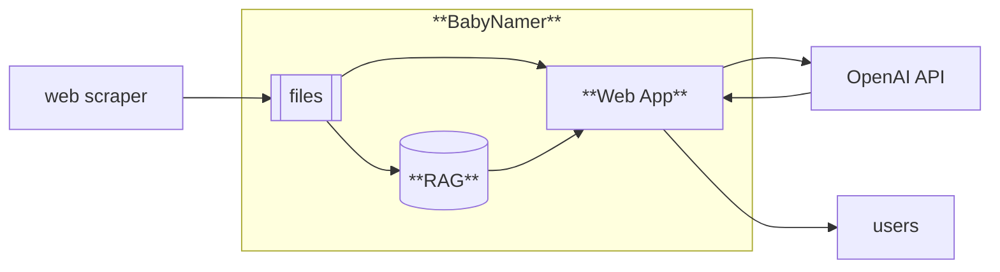
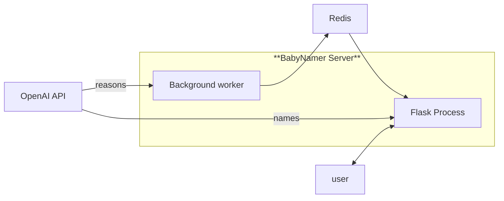

# AI Baby Namer

## Goal
Baby namer is a kind of application which help parents to name newborns. The baby namers on the market ask parents to choose preferences through a bunch of predefined dropdowns or checkboxes, then use those preferences to recommend names for newborns.

The predefined list of preferences is limited. Our goal is to build a baby namer, through which parents can use text to express their preferences, and get quality recommendations of baby names.

## High-level Design
Given the free text of preferences from parents, it is natural to use ChatGPT as a tool to recommend names.

While ChatGPT is trained using broad text from Internet, it might not be trained with the excellent resources from a few popular naming websites:
- [BabyNames.com](https://babynames.com/), inlcuding the origin, the short meaning and the long meaning of the names
- [NameBerry.com](https://nameberry.com/), including a long humman-written description of the names
- [BehindTheName.com](https://www.behindthename.com/), including the history of the names and also the rating of the names

Therefore, the plan is to
1. scrape the above 3 websites, to gather rich information of all names
2. build a RAG (Retrieval-Augmented Generation) for all names
3. when a parent presents the preference text, search the RAG database to identity related names
4. put the related names and the related information as part of the prompt, feed to ChatGPT to get recommendation of names

Further, we want to use the scraped name information for parent to browse and read, besides for recommendation purpose.



The web scraping code lives in (web_scraper repo)[https://github.com/ABC-Tools/web_scraper]; and this repo contains yellow portion of above diagram.

## The RAG (Retrieval-Augmented Generation)
The RAG is a search database, with
- __input__: the embedding of preferences expressed by parents
- __output__: a list of potentially related names

Before that, we need to convert the meaning of all names into embedding, by the following steps:
1. cleanse the name informations
2. construct a paragraph of text using name informations
3. call OpenAI's `text-embedding-ada-002` model to create embeddings

To serve the embeddings, we chose Meta's [FAISS](https://github.com/facebookresearch/faiss). There are other choices of vector database, but I want to keep our solution simple. FAISS is a library, which I can load inside the web server.

FAISS supports different index/search algorithms. Given we have only a small amount of embeddings (30k), I simply chose the brute-force search (`IndexFlatIP`). Note I chose "inner product" as similarity measure, because the embeddings returned by OpenAI is normalized (the sum of squared elements euqlas to 1) therefore inner product is same as "cosin similarity".

### memory issue
The embedding is actually big; each embedding is 1536 float numbers. We have ~30k names, the memory comsumption for embedding is ~180M. This causes a problem
- because I load embedding inside the Flask server, each Flask process has one copy of the embeddings
- gunicorn will start multiple Flask proccess to serve web requests in parallel. The total memory comsuption goes up very quickly when we increase number of Flask workers. Further, this approach is pretty wasteful, given the embeddings are static and read-only. 

The ideal solution is to create a dedicate embedding process seperate Flask server, to save memory. However, I want to keep the solution as simple as possible. 

After some research, I found there is a [preload option](https://docs.gunicorn.org/en/stable/settings.html#preload-app) in gunicorn; quoted explaination:
> Load application code before the worker processes are forked.
>
> By preloading an application you can save some RAM resources as well as speed up server boot times. Although, if you defer application loading to each worker process, you can reload your application code easily by restarting workers.

This solves my problem, because now different Flask processes share the same memory of embeddings, as long as I never change the embedding values.


## OpenAI API
For OpenAI API, we need two outputs:
- recommended names
- recommendation reason for each name

I hope the recommendation reason can give a personalized experiecent to users. However, it takes a painfully long time  for OpenAI to generate the recommended reasons for 10 names (varying from 5 seconds to 60 seconds). Blocking the Flask process is not a good pratice.

To get around this problem, I decided to break this into 2 steps:
1. the Flask process gets the recommended names, and returns the names to the user immediately
2. the Flask process signals the background server to generate the recommendation reasons. This works because we show recommendation reason after the user click a recommended name.

For this to work, we need to establish a communication channel between the flask process and the background worker. I decided to use Redis as a communication channel. Redis costs a little extra money ($50 / month for single instance); but it also help for other purposes (like cahcing results). Therefore, the archtitecture is as follows:


## APIs
- **suggest_names()**
```
- input
        - session_id: required
        - gender: required
        - other: "parent preference text; whatever the user writes"
        - names_to_avoid: ["Mike", "Allen"]
        - family_name: Tan
        - * sibling_names: ["Kaitlyn", "George"]
        - * 'popularity_option': "Popular" / "Unique"
        - * 'style_option': "Classic"/"Modern",
        - ...
        - name_sentiments: an input JSON like
                    {
                        "Aron": {"sentiment": "liked", "reason": "sounds good"},
                        "Jasper": {"sentiment": "disliked", "reason": "my neighbor uses this name"},
                        "Jayden": {"sentiment": "saved"}
                    }
- return: a JSON list of name proposals
```

- **get_name_facts()**
```
- input
        - session_id: required
        - gender: required
        - name: required
- return: a json object like
    {
        "origin": "Hebrew",
        "short_meaning": "Rest, Peace"
        "meaning": "The name George is typically used as a nickname for names such as ...",
        "similar_names":[
            "Liam",
            "Elijah",
            ...
        ],
        "trend":{
            "1880": "26",
            ...
            "2021": "7"
        },
        "recommend_reason": "the name sounds great",
        "name_sentiments": {
            "sentiment": "disliked",
            "reason": "my neighbor uses this name"
        }
    }

```


## Data source of name frequency
https://www.ssa.gov/data.json; the exact record is
```
"dataQuality": null,
"describedBy": "https://www.ssa.gov/oact/babynames/background.html",
"describedByType": null,
"description": "The data (name, year of birth, sex, and number) are from a 100 percent sample of Social Security card applications for 1880 onward.",
"distribution": [
        {
          "description": null,
          "downloadURL": "https://www.ssa.gov/oact/babynames/names.zip",
          "format": "ZIP",
          "mediaType": "application/zip",
          "title": null
        }
]
```


## Development

The web app is deployed as K8S
### deploy
```
$ make build
$ make push_latest
$ make run_latest_image
```

### test code using local docker
```
$ docker compose up
$ curl http://127.0.0.1:8080/babyname/name_facts?name=Barbara
```

### test code in python shell
```commandline
$ . venv/bin/activate
$ sudo Python (sudo is required for disk access)
>>> from importlib import reload
>>> import tools.babyberry_result_rewriting as brr
>>> .... 
>>> (change babyberry_result_rewriting file)
>>> reload(brr)
```

### Python type cheat sheet
https://mypy.readthedocs.io/en/stable/cheat_sheet_py3.html


### set logging level in Python shell
```commandline
>>> logging.getLogger().setLevel(logging.DEBUG)
```
